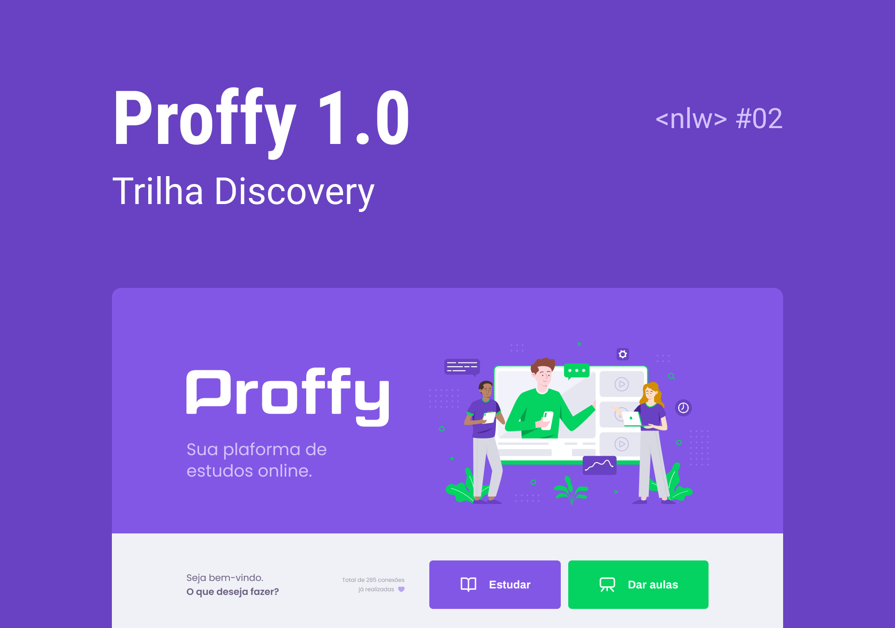

# Next Level Week 2 - Proffy

This is a web application developed at NLW 2. NLW is an online event with lots of code, challenges, networking, and a single goal: Advancing to the next level.

## Table of contents

- [Overview](#overview)
  - [The challenge](#the-challenge)
  - [Screenshot](#screenshot)
  - [Links](#links)
- [My process](#my-process)
  - [Built with](#built-with)
  - [What I learned](#what-i-learned)
  - [Continued development](#continued-development)
  - [Useful resources](#useful-resources)
- [Author](#author)

## Overview

### The challenge

Proffy is an online study platform that helps people find professors online.

Users should be able to:

- View the optimal layout of the site, depending on the screen size of your device
- View the float states for all interactive elements on the page
- If the user is a proffy, he can register a class by entering basic data such as name, profile picture, phone number, bio, subject, class cost, day(s) of the week, and time(s)
- If the user is a student, he can search for a registered lesson by filtering by subject, day of the week and time
- Receive an error message when the `form` is submitted if:
  - Any `input` field is empty. 


### Screenshot



### Links

- Project Layout: [https://www.figma.com/file/GQNQIlm59RYOtD5JaQt9Fy/Proffy-Web?node-id=0%3A1](https://www.figma.com/file/GQNQIlm59RYOtD5JaQt9Fy/Proffy-Web?node-id=0%3A1)

## My process

### Built with 

- [Mobile first](https://medium.com/@Vincentxia77/what-is-mobile-first-design-why-its-important-how-to-make-it-7d3cf2e29d00)
- [Semantic HTML5 markup](https://html.com/semantic-markup/)
- [CSS custom properties](https://www.w3schools.com/cssref/)
- [Flexbox](https://www.w3schools.com/csS/css3_flexbox.asp)
- [CSS Grid Layout](https://www.w3schools.com/css/css_grid.asp)
- [JavaScript](https://developer.mozilla.org/pt-BR/docs/Web/JavaScript)
- [Node.js](https://nodejs.org/en/)
- [Express](https://expressjs.com/)
- [SQLite](https://www.sqlite.org/index.html)
- [Nunjucks](https://mozilla.github.io/nunjucks/)

### What I learned

In this project I reviewed some basic HTML and CSS concepts, mainly the semantic tags and the main css properties regarding the page layout, using properties like flexbox and css grid. I learned about the concept of mobile first and its importance in the design and development of digital products. Furthermore, I learned the syntax and main properties of the nunjucks template engine and how it can be an enabler when writing more powerful and dynamic HTML. Furthermore, I learned how to create and configure a server using the express framework and how to create the application routes. I also learned some node.js to run JavaScript on the backend. And last but not least I got to know and learned the process of creating and manipulating the database using the SQLite library as well as learning a bit about SQL.

**HTML `<fieldset>` Tag**

The HTML element `<fieldset>` is used to group elements within a web form.

```html
<!-- Grouping 1 -->
<fieldset>
  <legend>Seus dados</legend>
  <div class="input-block">
    <label for="name">Nome completo</label>
    <input name="name" type="text" id="name" required>
  </div>
</fieldset>

<!-- Grouping 2 -->
<fieldset>
  <legend>Sobre a aula</legend>
  <div class="input-block">
    <label for="cost">Custo da sua hora <small>(R$)</small></label>
    <input type="number" name="cost" id="cost">
  </div>
</fieldset>
```

**CSS `:focus-within` pseudo-elements**

The `:focus-within` CSS pseudo-class matches an element if the element or any of its descendants are focused.

```css
 /* Se elemento input-block ou filhos estiverem em foco */ 
.input-block:focus-within::after { 
  content: "";
  height: 2px;
  width: calc(100% - 3.2rem);
  background-color: var(--color-primary-light);
  position: absolute;
  left: 1.6rem;
  right: 1.6rem;
  bottom: 0px;
}
```

**CSS `element1 > element2` Selector**

Select and style every element1 element where the parent is a element2 element

```css
/* Selecione e estilize cada elemento <p> onde o pai é um elemento div.teacher-item */
.teacher-item > p {
  padding: 0 2rem;
  font-size: 1.6rem;
  line-height: 2.8rem;
}
```

**CSS `element1 + element2` Selector**

Select and style the first element2 element that are placed immediately after element1 elements

```css
/* Selecione e estilize cada elemento .input-block que são colocados 
imediatamente a seguir aos elementos .input-block e .select-block */
#page-give-classes #schedule-items .input-block + .input-block,
#page-give-classes #schedule-items .select-block + .input-block {
  margin-top: 0;
}
```

### Continued development

It's been a while since I stopped studying Front-end Development because of university studies, but this week I'm going back to school, I intend to start again, getting back to basics and progressing, that is, I'm going to do many projects this year for my improvement in the area.

### Useful resources

- [Animation.css](https://animate.style) - This is the link to the Animation.css library website
- [Valid property](https://css-tricks.com/almanac/selectors/v/valid/) - Here is the link that talks a little about the pseudo-element :valid

## Author

- Codewars - [Ezequiel Santos](https://www.codewars.com/users/Ezequiel%20Santos)
- Frontend Mentor - [@ezequielsan](https://www.frontendmentor.io/profile/ezequielsan)
